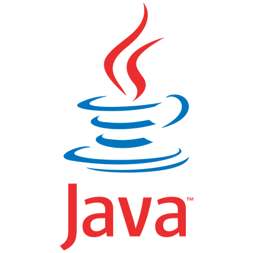
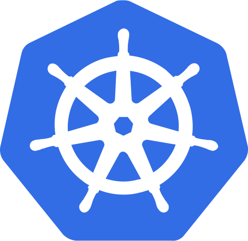

## Hi there 

I am Abhay H Kashyap, studying Computer Science and Engineering in R.V. College of Engineering, Bengaluru, India.

I am a Student, Web Developer and Deep Learning Researcher , Astronomy and Astrophysics enthusiast.

- 📱 I am currently working Samsung PRISM project about instant apps.
- 🕸 I have recently started exploring Deep Learning.

Some of the projects I have previously worked on are:
1. [Conditional Independence using RCoT](https://github.com/mayank-agarwal-ln/RCoT)
2. [💸 Personal Finance Manager using Java](https://github.com/abhayhk2001/Personal-Finance-JavaFX)
3. [💉 Rural Vaccination Drive Portal](https://github.com/abhayhk2001/DTL)
4. [📝 React-Todo Application](https://taskcompleted-react.netlify.app/)
5. [ Graph Algorithm Visualizer](https://graphviz.netlify.app/)

[Reach Me here: 📮](https://www.linkedin.com/in/abhay-h-kashyap/)

Langauges:

 &ensp;
     &ensp;
     &ensp;
     &ensp;
     &ensp;
     &ensp;

 

Frameworks and Libraries:

     &ensp;
     &ensp;
     &ensp;
     &ensp;
     &ensp;
     &ensp;
     &ensp;
     &ensp;

 

Technologies:

     &ensp;
     &ensp;
     &ensp;
     &ensp;
     &ensp;
     &ensp;
     &ensp;
     &ensp;

 

Tools:

     &ensp;
     &ensp;
     &ensp;

 

<!--  -->