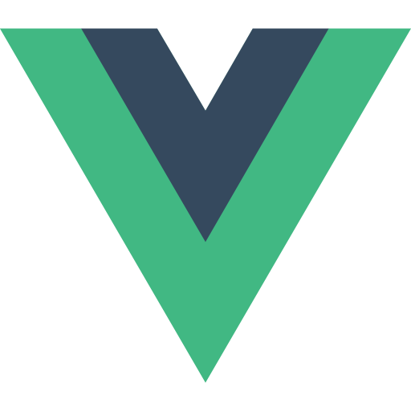

# Hi there 

<!-- I am Abhay H Kashyap, pursuing my bachelors in Computer Science and Engineering at R.V. College of Engineering, Bengaluru, India and interning at Qualcomm India. 

I would describe myself as a Student, and a Computer Enthusiast. I have worked in the fields of ML, Blockchain and Web Development. I like to explore new areas and find interesting work in them.

I am also passionate about astronomy and computational astronomy. (Would like to pursue futhur if you have any suggestions let me know) -->

I am Abhay, this is a short bio about me.


```json
{
    "name": "Abhay H Kashyap",
    "education": [
        {
            "school": "Navkis Educational Center",
        },
        {
            "college": "R.V. College of Engineering",
            "degree": "Bachelors of Engineering",
            "major": "Computer Science and Engineering"
        }
    ],
    "describe": "student, computer science enthusiast",
    "passion": "astronomy and astrophysics",
    "fields": ["ML", "Blockchain", "Web Dev"],

    "currently": [
        "Interning at Qualcomm",
        "Starting my Portfolio Website",
        "Exlopring writing with Medium"
    ],
    "projects":[
        {
            "name": "",
            "description": "",
        }
    ]

}
```

Some projects I have previously worked on are:
1. [Conditional Independence using RCoT](https://github.com/mayank-agarwal-ln/RCoT)
2. [💸 Personal Finance Manager using Java](https://github.com/abhayhk2001/Personal-Finance-JavaFX)
3. [💉 Rural Vaccination Drive Portal](https://github.com/abhayhk2001/DTL)
4. [📝 React-Todo Application](https://taskcompleted-react.netlify.app/)
5. [ Graph Algorithm Visualizer](https://graphviz.netlify.app/)

<details>
<summary>Langauges:</summary>
<hr>&ensp;
     &ensp;
     &ensp;
     &ensp;
     &ensp;
     &ensp;
     &ensp;
</details>
<br>

<details>
<summary>Frameworks and Libraries:</summary>
<hr>&ensp;
     &ensp;
     &ensp;
     &ensp;
     &ensp;
     &ensp;
     &ensp;
     &ensp;
     &ensp;
</details>
<br>

<details>
<summary>Technologies:</summary>
<hr>&ensp;
     &ensp;
     &ensp;
     &ensp;
     &ensp;
     &ensp;
     &ensp;
     &ensp;
     &ensp;
</details>
<br>

<details>
<summary>Tools:</summary>
<hr>&ensp;
     &ensp;
     &ensp;
     &ensp;
</details>
<br>


## My GitHub Statistics: 
<hr>
<br>
<p align="center">

</p>

### Reach Me here: &ensp; [](https://www.linkedin.com/in/abhay-h-kashyap/) &ensp;  [](mailto:abhayastro1004@gmail.com) &ensp; [](https://medium.com/@abhay_hk)